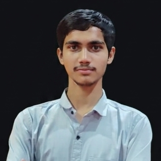

# 🚀 Sangam Kumar Yadav - Personal Portfolio

Welcome to my personal portfolio website repository! I am a B.Tech Computer Science & Engineering student at **Lovely Professional University (LPU)**, passionate about Artificial Intelligence, Computer Vision, Web Automation, and Software Systems.



---

## ✨ Features & Highlights

- **Aesthetic Dual Glow Styling**: Designed with a sleek Dark Blue & Purple aesthetic, vibrant ambient lighting, and smooth scroll reveal animations.
- **Interactive Lightbox Modal**: Click on any certification card to preview credentials and verify them online.
- **Responsive Layout**: Optimized across desktop, tablet, and mobile displays.
- **Working Contact Form**: Integrated with FormSubmit for real-time email delivery.
- **Direct Asset Downloads**: One-click download buttons for official CV/Resume and accreditation documents.

---

## 🛠️ Tech Stack & Skills

- **Languages**: Python, C, C++, SQL, HTML5, CSS3, JavaScript
- **Frameworks & Core**: Flask, OpenCV, NumPy, Selenium (Web Automation), REST APIs, GitHub OAuth, DBMS
- **Databases & Tools**: MySQL, Git, GitHub, VS Code

---

## 📁 Repository Structure

```
my_portfolio_2/
├── index.html                    # Main HTML5 entry point & CSS/JS
├── README.md                     # Repository documentation
└── assets/
    ├── images/
    │   └── Profile_pic.png       # Profile portrait photo
    ├── certificates/             # Certification images
    │   ├── Times_of_india_certificate.png
    │   ├── infosys_springboard certificate.png
    │   ├── Hp_life certificates.png
    │   └── linkedin_learning_certificate.png
    └── docs/                     # Official documents
        └── My_cv_final_pdf.pdf   # Official PDF Resume
```

---

## 🌐 Connect With Me

- **LinkedIn**: [sangam-yadav-b0778923b](https://www.linkedin.com/in/sangam-yadav-b0778923b/)
- **GitHub**: [sangam534](https://github.com/sangam534)
- **Email**: [sangamkumarsky@gmail.com](mailto:sangamkumarsky@gmail.com)

---

&copy; 2026 Sangam Kumar Yadav. All rights reserved.